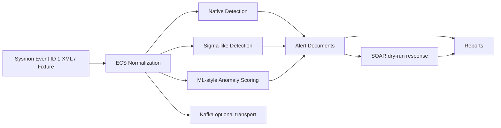

Status: done

# README, CI/CD, VM lab, and final demo polish

## Goal

Polish the repository for final demo/submission without changing core pipeline behavior.

This issue must restore and organize all final operator-facing documentation, including README, CI/CD, VM/lab setup, Docker services, demo commands, and architecture.

## Context

Phase 1 Foundation is complete.

Phase 2 Native Detection Pipeline MVP is complete.

Phase 3 Live Telemetry Pipeline, Sigma-like Detection, and Coverage Report are complete.

Phase 4 Kafka Normalized Event Detection Pipeline is complete.

Phase 5 SOAR Dry-run Response Pipeline is complete.

Phase 6 ML-style Process Anomaly Detection MVP is complete.

Phase 7 Final Demo Report and Operator Dashboard MVP is complete.

Current final test state:

- Full regression passes.
- Final demo report generates:
  - `reports/final_demo_report.json`
  - `reports/final_demo_report.md`

## What to build

Create a final documentation and CI polish pass that makes the repository demo-ready:

```text
README
  -> architecture docs
  -> VM/lab docs
  -> Docker/Kafka docs
  -> CI/CD docs and workflow
  -> final demo script
  -> cross-linked phase docs
  -> lightweight documentation tests
```

This is a polish issue. It should not change detection, Kafka, SOAR, ML, reporting, or normalization semantics.

## README

Update:

- `README.md`

README must include:

- Project title and current MVP status.
- Architecture overview.
- Completed phase list from Phase 1 to Phase 7.
- Capability matrix.
- Quickstart.
- Local Docker lab setup.
- Windows VM / Sysmon lab setup.
- Kafka local setup.
- CI/CD status and test commands.
- Final demo commands.
- Report artifact locations.
- Known limitations.
- Safety boundaries.

Suggested README structure:

```markdown
# EDR MVP Lab

## Current Status
## Architecture Overview
## Completed Phases
## Capability Matrix
## Quickstart
## Local Docker Lab
## Windows VM / Sysmon Lab
## Kafka Local Setup
## CI/CD
## Final Demo Commands
## Report Artifacts
## Known Limitations
## Safety Boundaries
## Documentation Index
```

README should link to:

- `docs/architecture.md`
- `docs/windows_vm_lab_setup.md`
- `docs/docker_lab_setup.md`
- `docs/cicd.md`
- `docs/final_demo_script.md`
- `docs/final_demo_report_mvp.md`
- Existing phase docs where useful.

## Architecture docs

Create or update:

- `docs/architecture.md`

Include:

- Mermaid architecture diagram.
- Data flow:

```text
Sysmon XML / fixture
  -> normalization
  -> native / Sigma-like / ML anomaly detection
  -> alerts
  -> Kafka optional transport
  -> SOAR dry-run response
  -> reports
```

- Elasticsearch indexes:
  - `edr-normalized-events-*`
  - `edr-alerts-native-*`
  - `edr-response-actions-*`
- Kafka topic:
  - `normalized-events`
- Safety boundary notes:
  - SOAR is dry-run.
  - ML is heuristic/deterministic.
  - Final report can run without live Elasticsearch/Kafka.

Mermaid diagram should be simple and stable enough for GitHub Markdown:



## VM/lab setup docs

Create or update:

- `docs/windows_vm_lab_setup.md`

Document:

- Windows VM role.
- Sysmon install/config expectation.
- Atomic Red Team execution expectation.
- Exporting or collecting Sysmon Event ID 1 XML.
- How fixture/XML input maps into the local pipeline.
- Local-only safety notes.
- Troubleshooting common VM issues.

Clarify:

- The VM is not required for tests.
- The repo contains deterministic fixtures for local validation.
- Atomic Red Team activity should only run in an isolated lab VM.
- Do not run Atomic Red Team tests on production endpoints.

Troubleshooting examples:

- Missing Sysmon service.
- Sysmon Event ID 1 not appearing.
- PowerShell execution policy blocks ART setup.
- XML export path wrong.
- Host timezone/timestamp confusion.

## Docker lab docs

Create or update:

- `docs/docker_lab_setup.md`

Document:

- Elastic/Kibana/Logstash Docker setup if already present.
- Kafka Docker setup using `docker-compose.kafka.yml`.
- Commands:

```powershell
docker compose up -d
docker compose -f docker-compose.kafka.yml up -d
docker compose ps
docker compose down
```

Troubleshooting:

- Kafka image/tag issue.
- Port `9092` conflict.
- Elasticsearch unavailable.
- Missing Kafka Python dependency.

Do not change compose behavior unless there is a clear bug.

## CI/CD

Create or update:

- `.github/workflows/ci.yml` if missing.
- `docs/cicd.md`

CI should run:

```powershell
python -m pytest tests
```

Requirements:

- Keep CI lightweight.
- Do not require Docker, Kafka, Elasticsearch, Kibana, or Windows VM in CI.
- CI should validate deterministic local tests only.
- Include Python setup.
- Include dependency install from requirements file if present.
- If no requirements file exists, document current expected install approach and avoid inventing unknown packages.

Workflow guidance:

- Use `actions/checkout`.
- Use `actions/setup-python`.
- Use a stable Python version supported by the codebase.
- If `requirements.txt` exists, install with:

```powershell
python -m pip install -r requirements.txt
```

Docs should explain:

- What CI validates.
- What CI intentionally does not validate.
- Manual checks for Docker/Kafka/Elasticsearch/VM paths.

## Final demo script

Create:

- `docs/final_demo_script.md`

Include a 5-minute operator demo flow:

1. Generate final report.
2. Show full test pass command.
3. Run live telemetry fixture with `engine all`.
4. Run Kafka dry-run producer/consumer.
5. Run SOAR fixture response.
6. Run ML benign fixture.
7. Optionally run Elasticsearch count report.
8. Point to generated reports.

Include exact commands:

```powershell
python scripts\reporting\generate_final_demo_report.py
python -m pytest tests
python scripts\pipeline\run_live_telemetry_pipeline.py --input fixture --fixture-detectable-powershell --engine all --output summary
python scripts\kafka\produce_normalized_event.py --input fixture --fixture-detectable-powershell --dry-run
python scripts\kafka\consume_and_detect.py --dry-run-fixture --engine all
python scripts\response\run_soar_response.py --input fixture-alert --output summary
python scripts\ml\run_process_anomaly_detection.py --input fixture --output summary
python scripts\reporting\generate_final_demo_report.py --include-elasticsearch --elasticsearch-url http://localhost:9200
```

If any command currently uses a different implemented flag, use the real current flag from the codebase. Do not invent a non-running command.

## Cross-links

Update docs to link final docs:

- `README.md`
- `docs/final_demo_report_mvp.md`
- `docs/live_telemetry_pipeline_mvp.md`
- `docs/kafka_pipeline_mvp.md`
- `docs/soar_response_mvp.md`
- `docs/ml_anomaly_mvp.md`

Add links only where they are useful and do not create noisy docs churn.

## Tests

Do not add broad code behavior changes.

If adding tests, only add documentation/report tests that verify:

- README references Phase 1 through Phase 7.
- README references CI/CD.
- README references Windows VM lab.
- README references Docker lab.
- README references final demo report.
- CI workflow exists if implemented.

Suggested test file:

- `tests/test_final_polish_docs.py`

Tests should only read docs/workflow files and assert key phrases/links. They must not require Docker, Kafka, Elasticsearch, Kibana, or Windows VM.

Run:

```powershell
python -m pytest tests
```

## Files to create or update

Create or update:

- `README.md`
- `docs/architecture.md`
- `docs/windows_vm_lab_setup.md`
- `docs/docker_lab_setup.md`
- `.github/workflows/ci.yml`
- `docs/cicd.md`
- `docs/final_demo_script.md`

Edit for cross-links if useful:

- `docs/final_demo_report_mvp.md`
- `docs/live_telemetry_pipeline_mvp.md`
- `docs/kafka_pipeline_mvp.md`
- `docs/soar_response_mvp.md`
- `docs/ml_anomaly_mvp.md`

Optional:

- `tests/test_final_polish_docs.py`

## Commands to run

Focused docs tests, if added:

```powershell
python -m pytest tests\test_final_polish_docs.py
```

Full regression:

```powershell
python -m pytest tests
```

Manual final report:

```powershell
python scripts\reporting\generate_final_demo_report.py
```

Manual final demo report check:

```powershell
Get-Content reports\final_demo_report.md
```

## Acceptance criteria

- [ ] `README.md` has project status, architecture overview, completed Phase 1-7 list, capability matrix, quickstart, Docker lab setup, Windows VM/Sysmon lab setup, Kafka setup, CI/CD, final demo commands, report artifacts, known limitations, and safety boundaries.
- [ ] `docs/architecture.md` exists and includes Mermaid architecture diagram, data flow, Elasticsearch indexes, and Kafka topic.
- [ ] `docs/windows_vm_lab_setup.md` exists and documents VM role, Sysmon, Atomic Red Team, Event ID 1 XML export, fixture/XML mapping, safety notes, and troubleshooting.
- [ ] `docs/docker_lab_setup.md` exists and documents Docker Compose, Kafka Compose, commands, and troubleshooting.
- [ ] `.github/workflows/ci.yml` exists and runs deterministic pytest suite without Docker/Kafka/Elasticsearch/Kibana/Windows VM.
- [ ] `docs/cicd.md` explains what CI validates and what remains manual.
- [ ] `docs/final_demo_script.md` exists with a 5-minute operator demo flow and real runnable commands.
- [ ] Useful cross-links are added from README and phase docs to final docs.
- [ ] Optional docs tests pass if added.
- [ ] `python -m pytest tests` passes.
- [ ] Core pipeline behavior remains unchanged.

## Blocked by

- `.scratch/phase-1-foundation/PRD.md`
- `.scratch/phase-2-detection-engine-mvp/issues/06-native-detection-pipeline-with-alert-indexing.md`
- `.scratch/phase-3-live-telemetry-pipeline/issues/01-live-telemetry-to-detection-pipeline.md`
- `.scratch/phase-3-live-telemetry-pipeline/issues/02-sigma-like-detection-mvp.md`
- `.scratch/phase-3-live-telemetry-pipeline/issues/03-detection-coverage-validation-report.md`
- `.scratch/phase-4-kafka-pipeline-mvp/issues/01-kafka-normalized-event-detection-pipeline.md`
- `.scratch/phase-5-soar-response-mvp/issues/01-soar-dry-run-response-pipeline.md`
- `.scratch/phase-6-ml-anomaly-mvp/issues/01-process-anomaly-detection-mvp.md`
- `.scratch/phase-7-dashboard-report-mvp/issues/01-final-demo-report-and-operator-dashboard.md`

## Out-of-scope boundaries

- Do not change detection semantics.
- Do not change Kafka behavior.
- Do not change SOAR behavior.
- Do not change ML scoring.
- Do not add new detection rules.
- Do not add new Sysmon Event IDs.
- Do not require Docker in CI.
- Do not require Kafka in CI.
- Do not require Elasticsearch in CI.
- Do not require Windows VM in CI.
- Do not add real containment.
- Do not add TheHive.

## Comments
