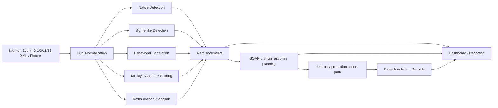

# Architecture

This repo implements a local EDR MVP lab using a five-layer architecture:

```text
collection -> normalization -> detection -> response -> reporting
```

The implemented path is deterministic by default and can run from fixtures without live Docker, Kafka, Elasticsearch, Kibana, or a Windows VM.

## Data Flow

```text
Sysmon XML / fixture
  -> normalization
  -> native / Sigma-like / behavioral correlation / ML anomaly detection
  -> alerts
  -> Kafka optional transport
  -> SOAR dry-run response planning
  -> lab-only protection action path
  -> protection action records
  -> dashboard/reporting
```



## Components

| Layer | Implemented component | Notes |
| --- | --- | --- |
| Collection | Sysmon XML fixture, optional Logstash HTTP ingest, optional Kafka producer | Fixture path is deterministic. |
| Normalization | `normalization/sysmon/event_router.py` and event-specific Sysmon normalizers | Supports Sysmon Event ID 1 Process Create, 3 Network Connection, 11 File Create, and 13 Registry Value Set. |
| Detection | Native rules, Sigma-like rules, behavioral sequence correlation, ML-style anomaly scorer | Covers `T1059.001`, deterministic `T1105`, `T1547.001`, `T1218-lite`, and Phase 14 local sequence correlation. |
| Response | SOAR dry-run response planner and guarded lab-only protection action path | SOAR produces planned actions; kill-process is dry-run by default and lab-only when explicitly executed. |
| Reporting | Detection coverage, Phase 9 dashboard data, and final demo reports | Writes JSON/Markdown artifacts and dashboard evidence data. |

## Elasticsearch Indexes

- `edr-normalized-events-*`: normalized ECS event documents.
- `edr-alerts-native-*`: native, Sigma-like, and ML-style alert documents.
- `edr-response-actions-*`: SOAR dry-run response records.
- `edr-protection-actions-*`: lab-only protection action records.

Elasticsearch is optional for deterministic tests. It is used for manual lab validation and optional final report counts.

## Kafka Topic

- `normalized-events`: normalized ECS event transport topic.

Kafka is optional for live transport. Tests and demos use dry-run/in-memory helpers unless a live broker is explicitly started.

## Safety Boundaries

- SOAR is dry-run only.
- No production containment is implemented.
- The kill-process protection action is lab-only, dry-run by default, safe-by-default, and requires explicit flags for execution.
- ML anomaly detection is heuristic and deterministic.
- The final report can run without live Elasticsearch or Kafka.
- No host isolation, network block, production endpoint modification, TheHive, or external ticketing integration is implemented.

## Related Docs

- [README](../README.md)
- [Docker Lab Setup](docker_lab_setup.md)
- [Windows VM / Sysmon Lab Setup](windows_vm_lab_setup.md)
- [Sysmon Event Coverage](sysmon_event_coverage.md)
- [Multi-technique Detection Coverage](multi_technique_detection_coverage.md)
- [Behavioral Correlation Detection](behavioral_correlation_detection.md)
- [Final Demo Script](final_demo_script.md)
- [Demo Dashboard Design](demo_dashboard_design.md)
- [Protection Action MVP](protection_action_mvp.md)
- [Known Stubs and Future Work](known_stubs_and_future_work.md)
